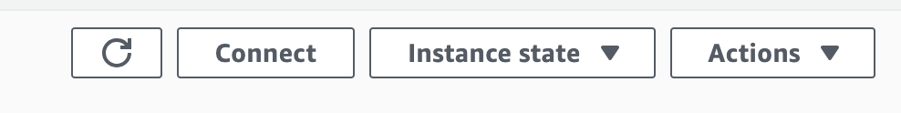

# pinterest-data-pipeline

This project is a work in progress.

## Project Brief

Build the system that Pinterest uses to analyse both historical, and real-time data generated by posts from their users.

Pinterest has world-class machine learning engineering systems. They have billions of user interactions such as image uploads or image clicks which they need to process every day to inform the decisions to make. In this project, I am building a system in the cloud that takes in those events and runs them through two separate pipelines. One for computing real-time metrics (such as profile popularity, which would be used to recommend that profile in real-time), and another for computing metrics that depend on historical data (such as the most popular category this year).

## Project Dependencies

In order to run this project, the following modules need to be installed:

- `python-dotenv`
- `sqlalchemy`

## The data

In order to emulate the kind of data that Pinterest's engineers are likely to work with, this project contains a script, [user_posting_emulation_to_console.py](user_posting_emulation_to_console.py) that when run from the terminal mimics the stream of random data points received by the Pinterest API when POST requests are made by users uploading data to Pinterest.

Running the script instantiates a database connector class, which is used to connect to an AWS RDS database containing the following tables:

- `pinterest_data` contains data about posts being updated to Pinterest
- `geolocation_data` contains data about the geolocation of each Pinterest post found in pinterest_data
- `user_data` contains data about the user that has uploaded each post found in pinterest_data

The `run_infinite_post_data_loop()` method then infinitely iterates at random intervals between 0 and 2 seconds, selecting all columns of a random row from each of the three tables and writing the data to a dictionary. The three dictionaries are then printed to the console.

Examples of the data generated look like the following:

pinterest_data:
```
{'index': 7528, 'unique_id': 'fbe53c66-3442-4773-b19e-d3ec6f54dddf', 'title': 'No Title Data Available', 'description': 'No description available Story format', 'poster_name': 'User Info Error', 'follower_count': 'User Info Error', 'tag_list': 'N,o, ,T,a,g,s, ,A,v,a,i,l,a,b,l,e', 'is_image_or_video': 'multi-video(story page format)', 'image_src': 'Image src error.', 'downloaded': 0, 'save_location': 'Local save in /data/mens-fashion', 'category': 'mens-fashion'}
```

geolocation_data:
```
{'ind': 7528, 'timestamp': datetime.datetime(2020, 8, 28, 3, 52, 47), 'latitude': -89.9787, 'longitude': -173.293, 'country': 'Albania'}
```

user_data:
```
{'ind': 7528, 'first_name': 'Abigail', 'last_name': 'Ali', 'age': 20, 'date_joined': datetime.datetime(2015, 10, 24, 11, 23, 51)}
```

## Tools used

- [Apache Kafka](https://kafka.apache.org/) - Apache Kafka is an event streaming platform. From the Kafka [documentation](https://kafka.apache.org/documentation/):
>Event streaming is the practice of capturing data in real-time from event sources like databases, sensors, mobile devices, cloud services, and software applications in the form of streams of events; storing these event streams durably for later retrieval; manipulating, processing, and reacting to the event streams in real-time as well as retrospectively; and routing the event streams to different destination technologies as needed. Event streaming thus ensures a continuous flow and interpretation of data so that the right information is at the right place, at the right time.

## Building the pipeline

### Create an Apache cluster using AWS MSK

The first stop in the pipeline for our data will be an Apache Kafka cluster in the AWS cloud ecosystem, using [Amazon Managed Streaming for Apache Kafka (MSK)](https://aws.amazon.com/msk/). The documentation includes a good guide for [getting started](https://docs.aws.amazon.com/msk/latest/developerguide/getting-started.html) and I will outline the steps taken to get a cluster up and running here.

1. Firstly, log into the AWS console and navigate to MSK via the 'Services' menu.
2. From the MSK menu, you can click on 'Create cluster' to start the process.
3. Here, you can choose from 'quick' or 'custom' create options and can name your cluster:


4. Scroll down and choose 'Provisioned' and specify the Kafka version and broker type. The type you choose will depend on requirements and cost considerations.


5. Finally, scroll down and click 'Create cluster'. The cluster can take between 15 and 20 minutes to create. When the cluster has been created, navigate to the 'Properties' tab, locate the network settings and take a note of the security group associated with the cluster. Next, click on 'View client information' and take a note of the bootstrap servers.

### Create a client machine for the cluster

Once your cluster is up and running, you'll need a client to communicate with it. As we're working on AWS, let's launch an EC2 instance to act as our client.

1. Navigate to the EC2 dashboard and click on 'Launch Instance':


2. Give your instance a name, e.g. 'pinterest-kafka-client'.
3. Keep the default Application and OS images, and instance type. Again, this choice may be determined by usage and cost considerations.


4. Create a new keypair for connecting securely to the instance via SSH. Give the keypair a descriptive name and choose 'RSA' and '.pem' for the type and file format, respectively. The .pem file will automatically download - keep this file safe for later use.


5. Keep the default settings for the other sections. Click on 'Launch Instance' in the right-hand summary menu.

### Enable client machine to connect to the cluster

In order for the client machine to connect to the cluster, we need to edit the inbound rules for the security group associated with the cluster.

1. In the left-hand EC2 menu, click on 'Security Groups'.
2. Select the security group associated with the Kafka cluster (noted earlier).
3. Select the 'Inbound rules' tab and then click on 'Edit inbound rules'.
4. Click on 'Add rule'. Choose 'All traffic' for the type, and then select the security group associated with the EC2 instance.
5. Save the rules.

We also need to create an IAM role for the client machine.

1. Navigate to the AWS IAM dashboard, select 'Roles' from the left-hand menu and then click on 'Create role'.
2. Select 'AWS service' and 'EC2', then click on 'Next'.
3. On the next page, select 'Create policy'.
4. In the policy editor, choose JSON format and paste in the following policy. **Note: this policy is somewhat open - a more restrictive policy would be more appropriate for a production environment**:

```bash
{
    "Version": "2012-10-17",
    "Statement": [
        {
            "Effect": "Allow",
            "Action": [
                "kafka-cluster:Connect",
                "kafka-cluster:AlterCluster",
                "kafka-cluster:DescribeCluster"
            ],
            "Resource": [
                "arn:aws:kafka:<region>:<AWS-ID>:cluster/<cluster-name>/*"
            ]
        },
        {
            "Effect": "Allow",
            "Action": [
                "kafka-cluster:*Topic*",
                "kafka-cluster:WriteData",
                "kafka-cluster:ReadData"
            ],
            "Resource": [
                "arn:aws:kafka:<region>:<AWS-ID>:topic/<cluster-name>/*"
            ]
        },
        {
            "Effect": "Allow",
            "Action": [
                "kafka-cluster:AlterGroup",
                "kafka-cluster:DescribeGroup"
            ],
            "Resource": [
                "arn:aws:kafka:<region>:<AWS-ID>:group/<cluster-name>/*"
            ]
        }
    ]
}
```

5. On the next page, give the policy a descriptive name and save the policy.
6. Back in the create role tab in the browser, click refresh to show the new policy and select the policy.
7. Click 'Next', give the role a descriptive name and save the role.
8. In the EC2 dashboard, click on the client instance.
9. Under 'Actions' and 'Security', click on 'Modify IAM role'.
10. Select the role just created and click on 'Update IAM role'.

### Install Kafka on the client machine

1. Once the new instance is in the running state, you can connect via SSH to interact with the instance via the command line. To do this, click on the instance ID to open the summary page, then click on 'Connect':



2. Follow the instructions in the 'SSH' tab to connect to the instance.

```bash
# make sure key is not publicly viewable
chmod 400 pinterest-kafka-client-keypair.pem
# connect
ssh -i "pinterest-kafka-client-keypair.pem" ec2-user@<instance-public-DNS>
```

3. Now on the instance command line:

```bash
# install Java - required for Kafka to run
sudo yum install java-1.8.0
# download Kafka - must be same version as MSK cluster created earlier
wget https://archive.apache.org/dist/kafka/2.8.1/kafka_2.12-2.8.1.tgz
# unpack .tgz
tar -xzf kafka_2.12-2.8.1.tgz
```

4. Install the [MSK IAM package](https://github.com/aws/aws-msk-iam-auth) that will enable the MSK cluster to authenticate the client:

```bash
# navigate to the correct directory
cd kafka_2.12-2.8.1/libs/
# download the package
wget https://github.com/aws/aws-msk-iam-auth/releases/download/v1.1.5/aws-msk-iam-auth-1.1.5-all.jar
```

5. Configure the client to be able to use the IAM package:

```bash
# open bash config file
nano ~/.bashrc
```

Add the following line to the config file, then save and exit:

```bash
export CLASSPATH=/home/ec2-user/kafka_2.12-2.8.1/libs/aws-msk-iam-auth-1.1.5-all.jar
```

Continue with configuration:

```bash
# activate changes to .bashrc
source ~/.bashrc
# navigate to Kafka bin folder
cd ../bin
# create client.properties file
nano client.properties
```

Add the following code to the client.properties file, then save and exit:

```bash
# Sets up TLS for encryption and SASL for authN.
security.protocol = SASL_SSL

# Identifies the SASL mechanism to use.
sasl.mechanism = AWS_MSK_IAM

# Binds SASL client implementation.
sasl.jaas.config = software.amazon.msk.auth.iam.IAMLoginModule required;

# Encapsulates constructing a SigV4 signature based on extracted credentials.
# The SASL client bound by "sasl.jaas.config" invokes this class.
sasl.client.callback.handler.class = software.amazon.msk.auth.iam.IAMClientCallbackHandler
```

### Create topics on the Kafka cluster

It is now possible to create topics on the Kafka cluster using the client machine command line. The command for creating topics is as follows. Use the boostrap server string noted earlier after cluster creation.

```bash
<path-to-your-kafka-installation>/bin/kafka-topics.sh --create --bootstrap-server <BootstrapServerString> --command-config client.properties --topic <topic name>
```

For this project, I created three topics. One each for the `pinterest_data`, `geolocation_data`, and `user_data` outlined above.

### Delivering messages to the Kafka cluster

Now that our cluster is up and running, and the client is configured to access the cluster and create topics, it's possible to use the client to create producers for streaming messages to the cluster, and consumers for accessing those messages.

However, for this project I used the Confluent package to set up a REST API on the client that listens for requests and interacts with the Kafka cluster accordingly.

To do this, first download the Confluent package to the client from the client's command line:

```bash
# download package
sudo wget https://packages.confluent.io/archive/7.2/confluent-7.2.0.tar.gz
# unpack .tar
tar -xvzf confluent-7.2.0.tar.gz 
```

Next, modify the kafka-rest.properties file:

```bash
# navigate to the correct directory
cd cd confluent-7.2.0/etc/kafka-rest/
nano nano kafka-rest.properties
```

Change the `bootstrap.servers` and the `zookeeper.connect` variables to those found in the MSK cluster information. Add the following lines to allow authentication:

```bash
# Sets up TLS for encryption and SASL for authN.
client.security.protocol = SASL_SSL

# Identifies the SASL mechanism to use.
client.sasl.mechanism = AWS_MSK_IAM

# Binds SASL client implementation.
client.sasl.jaas.config = software.amazon.msk.auth.iam.IAMLoginModule required awsRoleArn="Your Access Role";

# Encapsulates constructing a SigV4 signature based on extracted credentials.
# The SASL client bound by "sasl.jaas.config" invokes this class.
client.sasl.client.callback.handler.class = software.amazon.msk.auth.iam.IAMClientCallbackHandler
```

The inbound rules for the client security group also need to be modified to allow incoming HTTP requests on port 8082. On the AWS 'Security groups' page, choose the security group attached to the client, and add the following inbound rule:


To start the REST API, navigate to the `confluent-7.2.0/bin` folder and run the following command:

```bash
./kafka-rest-start /home/ec2-user/confluent-7.2.0/etc/kafka-rest/kafka-rest.properties
```

We can test if the API can receive requests by opening a web browser and going to "http://ec2-3-85-231-64.compute-1.amazonaws.com:8082/topics". The response should be displayed in the browser window and look something like:

```bash
["data.pin","data.user","__amazon_msk_canary","data.geo"]
```

